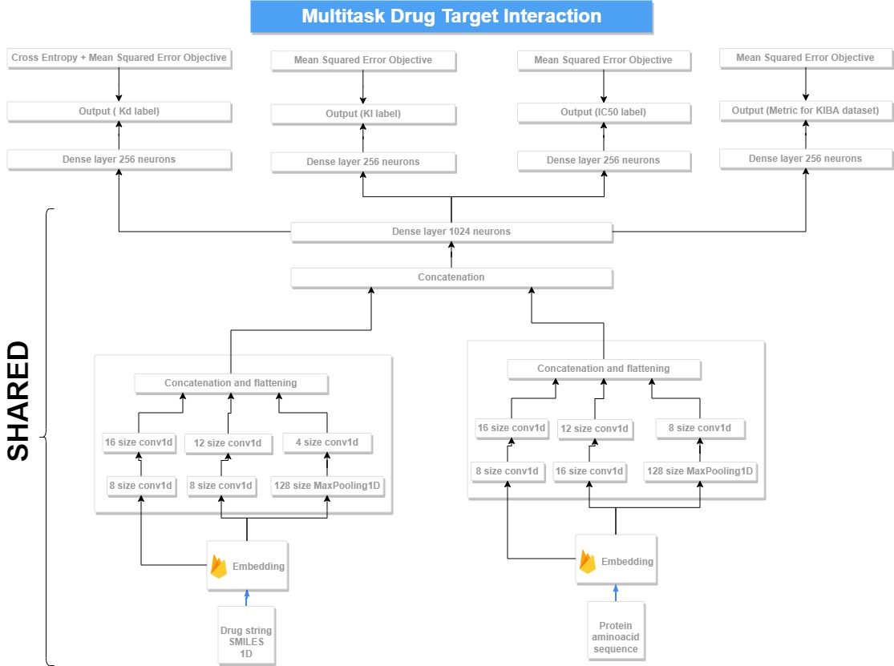

# DTAPred: Multi-task Drug Target Interaction prediction with Deep Learning.

The model allows one to predict many types of interaction properties between a protein and a ligand, such as IC50, Kd and KI through its
multi-task oriented architecture.


The first component in the DTAPred extracts information from the protein 1D sequence and ligand's SMILES sequence. This part is shared across all the
interaction types (e.g. KD, IC50 and KI), has CNN and 1 (or more) fully connected layer. The second component is an interaction specific
fully connected layers which are not shared.

## Running trained model

```
cd docker
docker build -t dta_pred
docker run -it --rm -v ${PWD}/io:/input -v ${PWD}/io:/output  dta_pred

```
Here `${PWD}/io` denotes the folder where you have the input.csv and also where the output.csv will be saved.

Example input template file can be found [`data/template.csv`](data/template.csv)

You are expected to put SMILES and Uniprot ID of the protein into the input.csv. Docker repo will retrieve the Kinase domain of the protein sequence
from the web using the Uniprot API. You can also put `fasta` instead of Uniprot ID, if you would like to make predictions for proteins that are not in Uniprot.